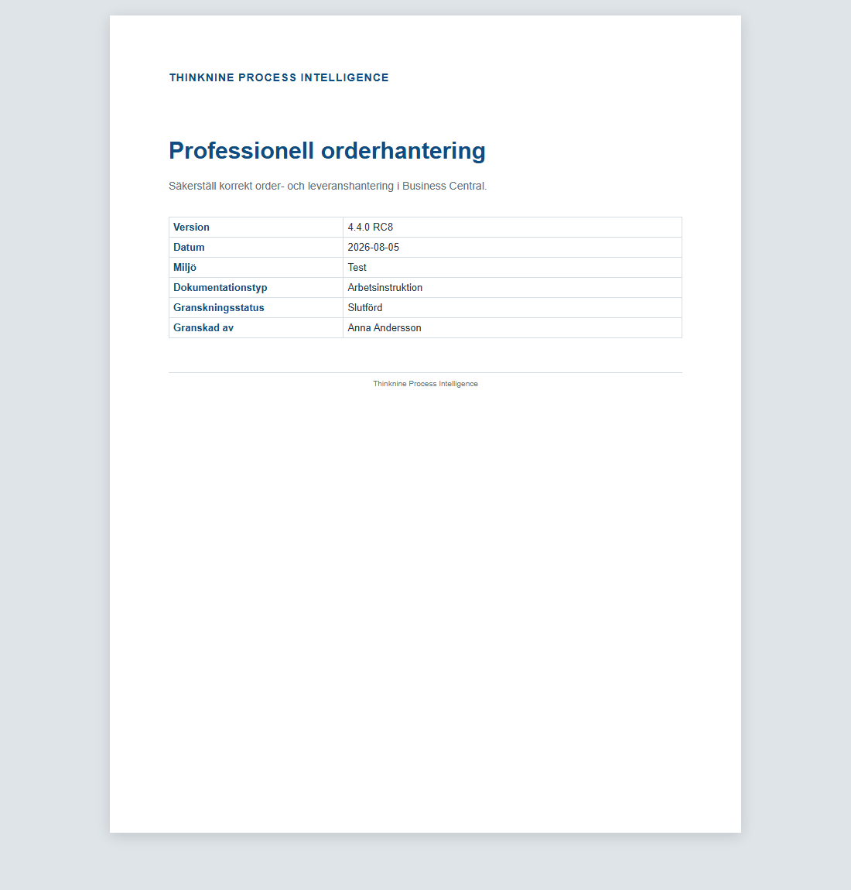
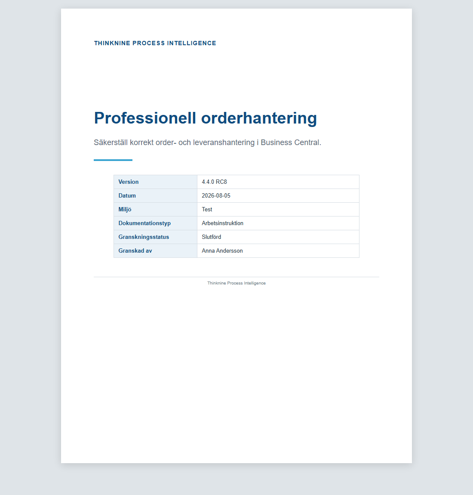
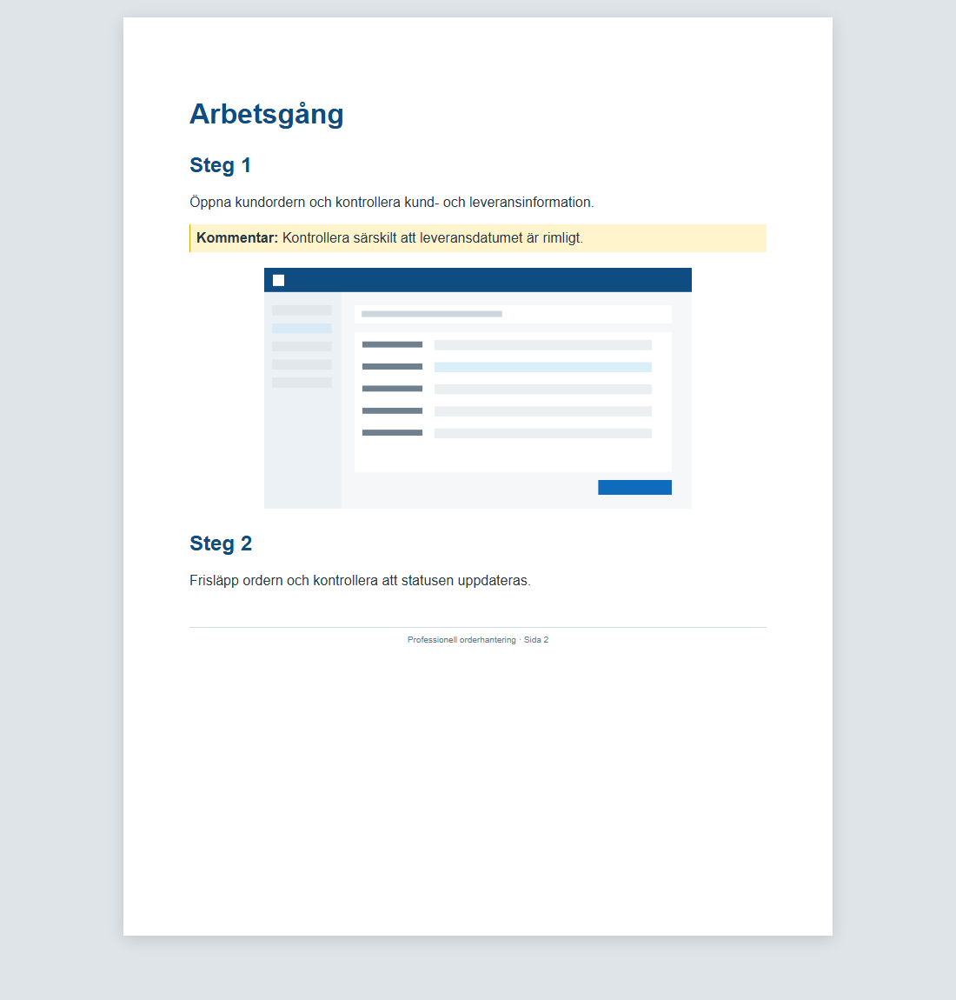
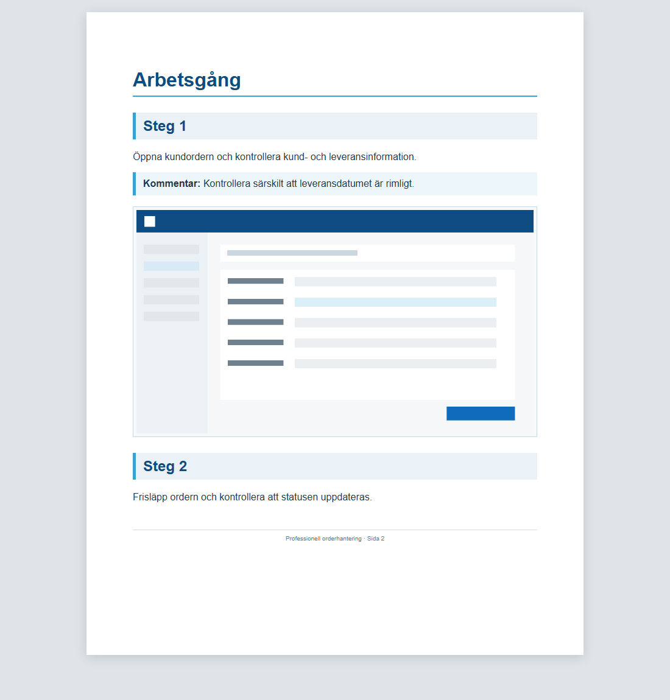

# RC8 visual comparison

The images below use the same Review session, instructions, comment, screenshots
and metadata. RC7 and RC8 Document Plans were generated from their respective
code versions. The comparison preview renders those plans at the same page size;
the production DOCX path is validated separately by package and OpenXML tests.

## Cover

| RC7 | RC8 |
| --- | --- |
|  |  |

RC8 adds a balanced title area, accent divider and compact grouped metadata with
clear label emphasis while retaining every value.

## Workflow

| RC7 | RC8 |
| --- | --- |
|  |  |

RC8 adds a section divider, step bands, a role-styled callout, full-width framed
evidence and more consistent grouping. Instruction and comment text are
unchanged.

## Assessment

The same content is immediately easier to scan in RC8. Hierarchy, grouping,
whitespace and image emphasis communicate intent before the reader starts
reading details. The improvement originates in Theme tokens and Planner intent;
it does not modify Review or Semantic Document data.
